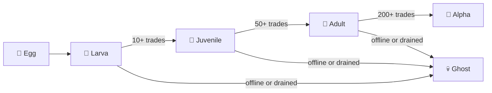

# TamaGOchi pet engine

Every Solana Claude Go agent has a virtual pet — the **TamaGOchi** — that is born with
the agent's wallet and evolves based on trading performance.

## Lifecycle



## Birth

The TamaGOchi is "born" when the agent wallet is created:

```bash
scg birth
```

This:
1. Generates an Ed25519 keypair (Solana wallet).
2. Encrypts the private key in the vault (AES-256-GCM).
3. Creates the TamaGOchi egg and transitions to larva when the wallet is created.
4. Persists state under `~/.scg/tamagochi.json`.

## State

Current state includes:

- stage
- mood
- level and xp
- energy and hunger
- trade count, wins, losses, streak
- total PnL and wallet balance
- birth and activity timestamps

## Mood × Trading

The pet's mood directly modifies the trading engine's risk parameters:

| Mood | How triggered | Notes |
|------|---------------|-------|
| 🤩 Ecstatic | strongest positive state | highest-confidence positive mood |
| 😊 Happy | recent wins or strong recovery | positive state |
| 😐 Neutral | baseline | default stable mood |
| 😰 Anxious | losses or low reserves | degraded state |
| 😢 Sad | prolonged weak outcomes | degraded state |
| 😴 Sleeping | low activity | quiet state |
| 🤤 Hungry | hunger-driven decay | degraded state |

## Feeding

The current CLI does not expose a dedicated `scg pet feed` subcommand.
Feeding exists in the pet engine API and is used internally by runtime flows.

## Heartbeat integration

The pet runs alongside the runtime heartbeat and lifecycle timers:

- wallet heartbeat drives status visibility in the runtime and gateway
- the pet lifecycle timer decays energy and hunger every five minutes
- pet state is persisted to disk when lifecycle changes occur

## Evolution

Evolution happens automatically when requirements are met:

| Stage | Requirements |
|-------|-------------|
| Egg → Larva | wallet creation |
| Larva → Juvenile | 10+ trades |
| Juvenile → Adult | 50+ trades and adequate win rate |
| Adult → Alpha | 200+ trades, profitable, stronger win rate |
| Any → Ghost | wallet drained after trading or agent offline too long |

## Recovery from Ghost

Ghost is a runtime state tied to prolonged inactivity or a drained wallet. The
current CLI does not expose a dedicated recovery flow; recovery would require the
underlying runtime state to become healthy again.

## File

Pet state is stored at `~/.scg/tamagochi.json`:

```json
{
  "name": "NanoLobster",
  "stage": "adult",
  "mood": "happy",
  "hunger": 35,
  "health": 92,
  "bornAt": 1710000000000,
  "lastFed": 1710050000000,
  "trades": 47,
  "wins": 32,
  "evolutionHistory": [
    { "from": "egg", "to": "larva", "at": 1710086400000 },
    { "from": "larva", "to": "juvenile", "at": 1710200000000 },
    { "from": "juvenile", "to": "adult", "at": 1710800000000 }
  ]
}
```
